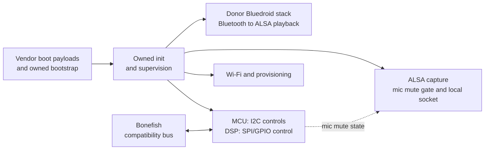

reInvoke is an open Linux runtime for the Harman Kardon Invoke
(`HKINVOKE`, FCC ID `APIHKINVOKE`), a 2017 smart speaker whose vendor service
was discontinued. Owned services replace the vendor application stack while
reusing the existing compute, audio and controls. The speaker boots from its
own NAND and needs no attached host.

This is a personal restoration project. Images are experimental and built for
one unit.

## Current status

Build `2.2.11`, running on one closed Invoke. Each row is something observed
on the unit, not something intended; [release validation](docs/release-validation.md)
records how each was observed and which checks require a human ear or eye.

| Scope        | Result                                                                                        |
| ------------ | --------------------------------------------------------------------------------------------- |
| Startup      | Boots from NAND on wall power with no host attached; seventeen supervised services             |
| Audio        | Bluetooth A2DP playback, startup chime, rotary volume following the donor's measured gain curve |
| Network      | Wi-Fi associates and leases; SSH and USB ADB both reachable from a cold boot                    |
| Microphone   | Capture verified by measurement, with the DSP mute gate proven to silence it                   |
| Persistence  | Wi-Fi credentials and Bluetooth stack configuration survive power loss                          |

What it does not do: there is no wake word, no assistant protocol and no voice
assistant of any kind. The audio and capture interfaces a local assistant would
need are implemented and tested; nothing consumes them yet. See
[remaining work](docs/revival-roadmap.md#remaining-work).

The [native guide](docs/native-nand-platform.md#current-result) owns the result
ledger and artifact pins. See the [product contract](docs/current-product-contract.md),
[version history](docs/versions.md) and
[documentation index](docs/README.md).

Builds are numbered `ERA.MILESTONE.ITERATION`: era `1` needed a host to boot,
era `2` boots from NAND alone. Earlier builds used several other conventions
and [version history](docs/versions.md) maps them.

## System overview

The packaged runtime separates media, hardware control, capture and network
ownership. This is software composition, not a board schematic or a native
process dump.



PCM uses ALSA. MCU I2C and DSP SPI/GPIO carry hardware control, not that audio
stream. Bonefish supplies compatibility calls, not authentication or a shell.

## Hardware and firmware

| Fact                                                           | Evidence                                      |
| -------------------------------------------------------------- | --------------------------------------------- |
| Marvell 88DE3006 / BG2CDP Berlin                               | Firmware and hardware corpus                  |
| 512 MiB DRAM                                                   | U-Boot observation                            |
| 256 MiB NAND; 2 KiB pages; 128 KiB erase blocks                | U-Boot, RAM Linux and logical main-data reads |
| Seven microphones, volume ring, touch panel, service Micro-USB | Manufacturer documentation                    |
| SD8887 firmware/calibration                                    | Donor assets and RAM driver bring-up          |

Seven physical microphones do not imply seven raw ALSA channels or verified
beamforming/AEC. The [hardware baseline](docs/corpus/01_CANONICAL_HARDWARE_BASELINE.md)
records unresolved component and signal-path identities.

The original Cortana product, final Bluetooth-oriented `12.2134.0` donor and
reInvoke are distinct systems. The pre-trial unit contained `12.2050.3`.
See the [firmware reference](docs/firmware-reference.md).

## Repository and build boundary

| Path                    | Contents                                                    |
| ----------------------- | ----------------------------------------------------------- |
| [docs/](docs/README.md) | Contracts, operating guides, journal and reference evidence |
| [metadata/](metadata/)  | Public acquisition provenance, sizes and hashes             |
| [tools/](tools/)        | Services, builders, analysis and recovery tools             |
| [patches/](patches/)    | Kernel patches, and BlueALSA patches kept for attribution    |

Public Git holds authored material and sanitized metadata; acquired originals
and generated images/captures remain in separate private storage. Acquisition
hashes identify originals, while build manifests identify generated artifacts.
See [storage policy](docs/acquisition/storage-policy.md).

Builders compose pinned donor and RC12 artifacts. A clean public clone lacks
some inputs, sysroots and libraries; deterministic composition is not a complete
reproducible build. See the [build boundary](docs/native-nand-platform.md#build-and-reproducibility-boundary).

## Installation and recovery

> [!CAUTION]
> Native installation erased and reprogrammed the whole good-block set.
> Byte-identical vendor boot payloads do not mean untouched boot-chain regions.
> Recovery worked after observed trials, not arbitrary boot-chain corruption.
> Logical main-data and exposed-OOB captures are not raw restore images.

Use [U-Boot access](docs/uboot-access.md) and the
[NAND installation boundary](docs/native-nand-platform.md#installation-boundary),
not an inferred flash recipe.

## Documentation checks

With Node.js 20.19 or later, run from the repository root:

```bash
npm --prefix scripts ci
npm --prefix scripts test
npm --prefix scripts run validate
```

The checker validates tracked Markdown, relative links/anchors and selected
credential patterns in tracked text. Tests include broken links and synthetic
private-data fixtures. Keep real identifiers in external private rules and
render changed Mermaid diagrams separately. See [coverage and limits](.github/SECURITY.md#repository-checks).

## Acknowledgements

This project stands on work other people published first.

- **[coggy9/HKHacking](https://github.com/coggy9/HKHacking)** — the firmware
  releases this project analysed, and the starting point for understanding the
  update bundle layout.
- **[jryruegas92/hk-invoke-arm-flasher](https://github.com/jryruegas92/hk-invoke-arm-flasher)**
  (MIT) — the USB recovery approach this project's boot tooling is built on,
  mirrored and pinned at commit `63444e8` in [P2-003](metadata/P2-003.json).
- **The wider Invoke community** — for establishing that these units are
  recoverable over USB at all, which is what made any of this reachable.
- **Harman Kardon and Marvell** — the original hardware and the donor firmware
  whose behaviour this project studied and, where practical, deliberately
  reproduced rather than reinvented.

Where this project's runtime imitates the donor firmware, that choice is
recorded at the point it is made, with the donor evidence that motivated it.
Where the design is this project's own, it says so.

## Licensing and attribution

Authored source, documentation and metadata use [MIT](LICENSE).
[Kernel patches](patches/invoke-kernel/) are GPL-2.0 derivatives;
[BlueALSA patches](patches/bluealsa/) retain MIT attribution.
Vendor evidence retains its original terms.

Firmware inputs came from [coggy9/HKHacking releases](https://github.com/coggy9/HKHacking/releases).
Public availability does not grant redistribution rights, and forks do not
preserve release assets. Custom deployment images remain private.

BlueALSA 4.0.0, BlueZ 5.55, SBC 2.0 and D-Bus 1.12.20 provenance is recorded
in [P1-045](metadata/P1-045.json). BlueALSA and BlueZ are no longer in the
image, which uses the donor Bluedroid stack; their patches and provenance are
kept because the repository still carries them. [Dropbear provenance](docs/native-nand-platform.md#offline-ssh-implementation-milestone)
is separate. Image distributors must assess each dependency's license
obligations. Report vulnerabilities through the [security policy](.github/SECURITY.md).
