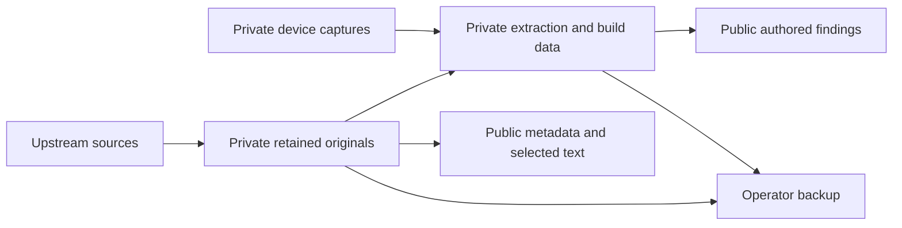

## Publication boundary

Git holds authored source and documentation, acquisition metadata, and selected
original vendor text, manuals and driver metadata. Full firmware packages,
extracted filesystems, generated images and device captures remain in an
operator-managed private archive. That archive is not a repository download.

An upstream download is not redistribution permission. Original vendor terms
and source licences remain applicable; the project MIT licence does not
relicense them. The custom image is not published. Deterministic composition
from pinned retained inputs is narrower than a complete fresh-clone build.

Keep credentials, operator configuration, device identities and cloud
coordinates out of public records. Removing a file from the current tree
does not remove it from published Git history.

## Storage classes

| Class               | Retain                                                                              | Authority                                                  |
| ------------------- | ----------------------------------------------------------------------------------- | ---------------------------------------------------------- |
| Public evidence     | Authored code, findings, source records, selected original text and bundle listings | Git history and [metadata](../../metadata/)                |
| Acquired originals  | Byte-exact donor archives, source packages and Git captures                         | Acquisition sidecar, revision and original notices         |
| Private working set | Extractions, toolchains, build outputs and device captures                          | Per-build or evidence manifests, not just acquisition JSON |
| Backup copies       | Selected originals and non-regenerable working data                                 | Private object inventory plus verified restore results     |

The [source catalogue](invoke_berlin_artifact_acquisition_manifest.md) identifies
what was acquired. The [firmware reference](../firmware-reference.md#retained-inputs)
identifies the useful public extraction layer and bundle totals. A listed ZIP
member need not be committed to Git.

### Provenance flow

This is a storage boundary, not an automated pipeline. Analysis derives from
retained originals and captures; only selected evidence enters Git. A backup
copies the private material without making it a public release.

### Why payloads stay outside Git

The acquisition-era working set was approximately 4.9 GB; this is not a census
of the later native archive. Compression tests gave little benefit on sampled
firmware: `zstd -19` left a 30 MB ZIP sample at 30 MB, and `gzip -1` reduced a
20 MB `83_IMAGE` sample only to 97% of its input size.

The two old `83_IMAGE` variants differ in 77.64% of container bytes despite
only 11 changed regular files. Filesystem rebuilds can therefore obscure small
logical changes in large binary deltas. Preserve original archives separately;
do not repack them to remove shared drivers or improve Git storage. Git LFS is
not used for these private inputs.

## Backup and restore

Azure Blob Storage is one operator backup choice, not a reInvoke platform
prerequisite. The retained configuration used private Cool-tier storage with
Entra authentication and HTTPS. Other storage can meet the same byte-retention
and verification requirements; public clones supply neither backup access nor
private inventory.

Backup selection must cover the intended analysis or build, not merely the
three vendor downloads. Preserve required originals, source revisions,
toolchain identities, generated-image manifests and non-regenerable evidence.
Keep a copy of the inventory alongside the objects it describes.

Restore into a separate destination, preserving archive-relative paths, then
verify the selected set before replacing an existing copy:

1. Compare acquired archives against their public sidecar's size and SHA-256.
2. Compare extracted members against recorded member digests, not the enclosing
   ZIP digest. Several incompatible inputs share the name `83_IMAGE`.
3. Verify generated images and captures against their own private manifests.
4. Check inventory completeness and report missing objects or mismatches.
   Do not repair a mismatch by repacking or overwriting the preserved original.

[P0-004c](../../metadata/P0-004c.json), for example, identifies the standalone
StockRoot donor, not the flashing-bundle member, OTA2 member, or a generated
native bundle served as `83_IMAGE`. Matching one hash establishes only that
object's integrity, not a complete restore or device compatibility.

Keep access credentials and signed URLs outside Git. Storage tier, retrieval
latency and retention charges are operator concerns; old cost estimates are
not current service guarantees. A backup is useful only if the required bytes
can be retrieved and verified.

Firmware-file recovery is separate from NAND recovery. Logical/OOB captures
are not raw restore images, and observed recovery after experiments does not
prove recovery from arbitrary boot-chain corruption. Use the
[NAND decision record](../nand-write-decision.md) for that boundary.

## Retention priorities

Priority reflects replacement difficulty and engineering value, not a claim
that this operator has the only surviving copy.

| Priority    | Material                                                          | Reason                                                                           |
| ----------- | ----------------------------------------------------------------- | -------------------------------------------------------------------------------- |
| Highest     | Non-regenerable device evidence and manifests for accepted builds | Later reconstruction cannot reproduce an observation                             |
| High        | HKHacking release assets P0-004a/b/c                              | Main-repository forks and source-history archives do not retain release binaries |
| High        | Relevant Discussions/wiki captures and linked attachments         | Separate capture is required outside the main Git mirror                         |
| High        | Exact donor sources and toolchains needed for known builds        | An upstream version label alone may not recover identical bytes                  |
| Conditional | Citation and gated Chromecast/Nest leads                          | Valuable potential sources, but complete package acquisition is unresolved       |
| Medium      | Acorn and other thinly mirrored legacy source histories           | Board-specific history may be difficult to replace                               |
| Lower       | Widely mirrored source history and disposable extractions         | Regenerable when originals, revisions and tools are retained                     |

The 2026-08-26 custody assessment found source-history redundancy for several
Git repositories, including Software Heritage snapshots, but not equivalent
coverage of the Invoke release assets. That dated observation is not a fresh
availability survey. Avoid treating fork counts as a guarantee of retention.

Retain byte-distinct variants with separate provenance even when filenames
match. Keep source notices and licences with packages. Independent custodians
can reduce reliance on a single copy where preservation terms permit, but
this does not authorize publishing proprietary firmware.

The excluded vendor filename is exactly `99_IMAGE`. Retaining it for format
or radio-lineage comparison does not make it an installation target; the
approved native bundle's use of `83_IMAGE` does not authorize other variants.
