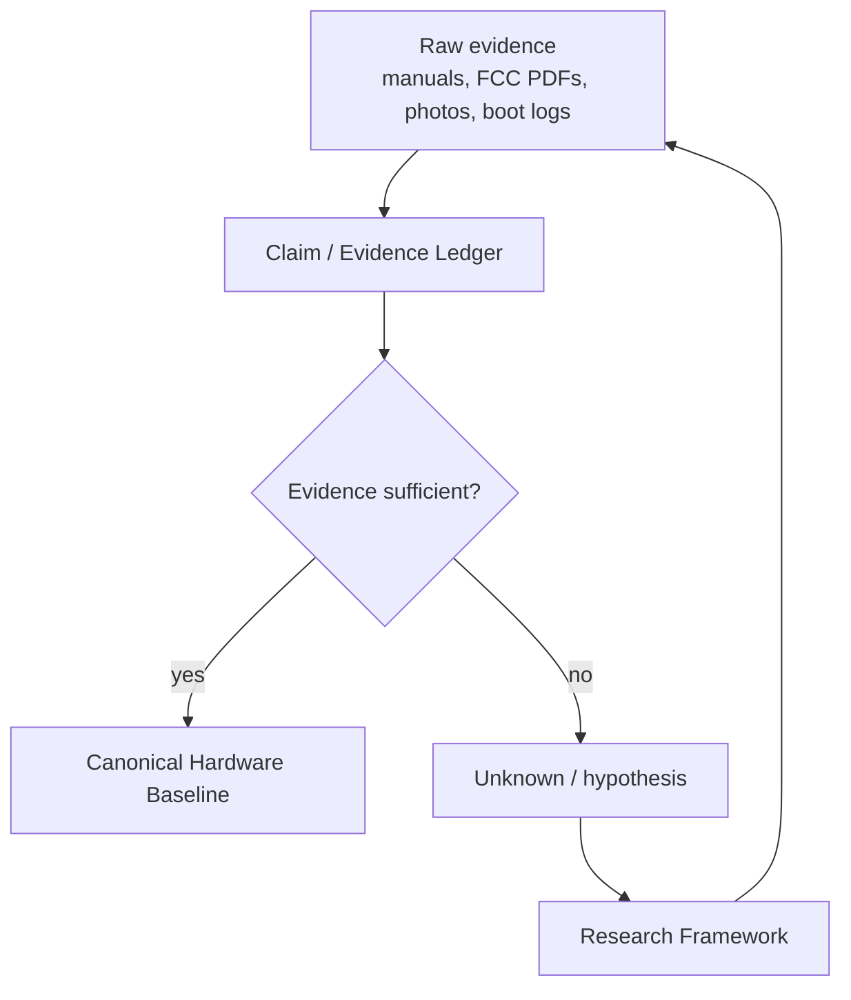

# Harman Kardon Invoke Hardware Corpus

## Purpose

This corpus establishes a hardware baseline for the Harman Kardon Invoke (`HKINVOKE`, FCC ID `APIHKINVOKE`) without silently converting guesses into facts.

The corpus is designed for reuse by LLMs, reverse-engineering researchers, and embedded developers. The governing rule is:

> **A claim must be traceable to evidence, or it remains explicitly unknown or hypothetical.**

This corpus deliberately distinguishes:
- manufacturer statements;
- regulatory evidence;
- direct visual observations from FCC internal photographs;
- third-party runtime observations from an actual Invoke;
- silicon facts that become applicable only after chip identity is established;
- deterministic inferences from established premises;
- hypotheses based on related platforms;
- unknowns.

## Documents

| File | Purpose | Normative status |
|---|---|---|
| `00_README.md` | Corpus schema, evidence policy, ingestion rules | normative methodology |
| `01_CANONICAL_HARDWARE_BASELINE.md` | Current hardware facts and only narrowly justified inferences | canonical working baseline |
| `02_CLAIM_EVIDENCE_LEDGER.md` | Atomic claims, evidence locators, confidence, contradictions, unknowns | evidentiary |
| `03_RESEARCH_FRAMEWORK_AND_CRITIQUE.md` | Research architecture, priorities, decision gates, critique | exploratory / non-canonical |
| `04_FCC_EXHIBIT_INVENTORY.md` | Held FCC exhibits, hashes, and what each establishes | evidentiary |
| `05_SIBLING_SOURCE_CROSSINDEX.md` | Findings transferred from mirrored Berlin-family source trees | evidentiary |

## Recommended ingestion behavior

For a factual answer:
1. ingest `00_README.md`;
2. ingest `01_CANONICAL_HARDWARE_BASELINE.md`;
3. consult `02_CLAIM_EVIDENCE_LEDGER.md` when provenance or confidence matters.

For planning or reverse engineering:
1. ingest all four documents;
2. do not promote a hypothesis from `03_RESEARCH_FRAMEWORK_AND_CRITIQUE.md` into a hardware fact without updating the ledger.

## Evidence classes

Use these labels exactly.

| Code | Class | Meaning |
|---|---|---|
| `MFG` | manufacturer-primary | Harman/Harman Kardon manual, spec sheet, support note, or release |
| `REG` | regulatory-primary | FCC filing, test report, internal photograph, grant data |
| `OBS-RUNTIME-3P` | third-party direct runtime observation | console output or filesystem/runtime data reported from an Invoke by an external researcher |
| `OBS-PHOTO` | direct visual observation | visible in an Invoke-specific regulatory/teardown photograph |
| `SILICON` | exact-silicon documentation | upstream Linux or vendor documentation describing a named IC |
| `DERIVED` | deterministic inference | arithmetic/logical consequence of cited premises; derivation must be shown |
| `HYP` | hypothesis | plausible but unproven on Invoke |
| `UNKNOWN` | unresolved | insufficient evidence |

## Confidence vocabulary

| Confidence | Use |
|---|---|
| `high` | direct manufacturer/regulatory evidence, or an unambiguous runtime/visual observation |
| `medium` | credible direct observation with incomplete independent confirmation |
| `low` | weak evidence or a hypothesis |

Confidence is **not** the same thing as evidence class. A `SILICON` fact can be high confidence about a chip's properties while the assertion that the Invoke contains that chip may still be only medium confidence.

## Claim model

Preferred machine-readable claim shape:

```yaml
claim_id: HKI-<DOMAIN>-<NNN>
statement: "One atomic factual statement."
status: confirmed | observed | derived | hypothesis | unknown | contested
evidence_class:
  - MFG
  - REG
source_ids:
  - HARMAN-OM
confidence: high
scope: product | mechanical | compute | storage | boot | radio | audio | microphones | ui | power
derivation: null
qualifiers: []
```

## Source citation grammar

Within this corpus, citations are written with stable local source IDs:

```text
[HARMAN-SPEC]
[HARMAN-OM p.8]
[FCC-INDEX]
[FCC-IP p.5]
[FCC-BT p.6]
[HKHACK lines 218-236]
[LINUX-MARVELL]
```

Every substantive hardware section in the canonical baseline carries one or more of these source IDs. Each document contains its own bibliography so it remains intelligible when ingested alone.

## Promotion rules

A claim may enter the canonical baseline when at least one of these conditions is met:

1. Harman explicitly documents it.
2. FCC material explicitly documents it.
3. It is unambiguously visible in Invoke-specific FCC imagery.
4. It is direct runtime output from an Invoke and the limitation that it is third-party evidence is preserved.
5. It is a deterministic inference whose premises are already established and whose derivation is shown.

A related-device analogy is **never sufficient by itself** for promotion.

## Anti-hallucination rules

Do not state as Invoke facts unless later evidence is added:
- exact RAM capacity;
- exact DRAM part number/type;
- exact NAND manufacturer/part number;
- exact Wi-Fi/Bluetooth combo IC;
- exact CPU clock configured by Harman;
- exact audio DSP;
- exact audio amplifier IC(s);
- Class-D topology;
- exact codec/ADC/DAC;
- microphone part number or electrical interface;
- LED protocol/driver;
- compute-module connector pinout;
- JTAG/UART pinout.

Do not infer a component merely because a Chromecast, Google Home, Kinoma, or other BG2CDP product uses it.

## Handling negative claims

Absence is hard to prove. Prefer:

> "The manufacturer product tour and FCC exterior/internal material document only X and Y external connectors."

over:

> "The device has absolutely no other interface."

Hidden pads and internal buses may exist.

## Contradictions

Contradictory sources are preserved rather than averaged.

Example pattern:

```yaml
claim_id: HKI-MECH-XXX
status: contested
variants:
  - value: ...
    source: ...
  - value: ...
    source: ...
resolution: unresolved
```

## Corpus architecture



## Bibliography

## Artifact acquisition

The [acquisition manifest](../acquisition/invoke_berlin_artifact_acquisition_manifest.md) is paired
with a reproducible, non-executing runner in [sources/acquisition/](../../sources/acquisition/).
`python3 sources/acquisition/acquire.py` downloads only explicitly specified URLs and
creates full Git mirrors. Originals are immutable, extracted files are placed
under `derived/extracted/`, and each operation writes a JSON provenance sidecar under
`derived/metadata/`. Existing destinations are skipped rather than overwritten. Large
acquired trees are excluded by `.gitignore`; manifests and metadata remain
versionable. Discovery-only records are logged as `DISCOVERY_ONLY` and are not
given fabricated URLs.

### HARMAN-SPEC
HARMAN International Industries, *Harman Kardon Invoke Specification Sheet*, 2017.  
URL: https://www.harmankardon.com/on/demandware.static/-/Sites-masterCatalog_Harman/default/dwf63bd00a/pdfs/HK_Invoke_Spec_Sheet_English.pdf  
Role: manufacturer-primary product specifications.

### HARMAN-OM
HARMAN International Industries, *Harman Kardon Invoke Owner's Manual*, product tour and specifications.  
URL: https://support.harmankardon.com/on/demandware.static/-/Sites-masterCatalog_Harman/default/dwdac694e8/pdfs/Harman%20Kardon%20Invoke%20Owners%20Manual.pdf  
Role: manufacturer-primary controls, microphones, service connector, dimensions/specifications.

### HARMAN-NEWS
HARMAN, *HARMAN Reveals the Harman Kardon Invoke Intelligent Speaker with Cortana from Microsoft*, 2017-10-02.  
URL: https://news.harman.com/releases/harman-reveals-the-harman-kardon-invokeTM-intelligent-speaker-with-cortana-from-microsoft  
Role: manufacturer-primary acoustic complement and SONIQUE description.

### HARMAN-FINAL
Harman Audio Support, *INVOKE: Final Software Update & Release Notes*, release 12.2314.0, 2021-09-08.  
URL: https://support.harmanaudio.com/howto/invoke-final-software-update-release-notes-us/000018514.html  
Role: manufacturer-primary final USB update path and firmware version.

### FCC-INDEX
FCC ID mirror for `APIHKINVOKE`, Harman International Industries.  
URL: https://fccid.io/APIHKINVOKE  
Role: regulatory filing index, equipment class, grant frequencies, bandwidth modes.

### FCC-IP
SGS/Harman, *Internal Photos*, FCC document ID 3374744, 9 pages.  
URL: https://fccid.io/APIHKINVOKE/Internal-Photos/Internal-Photos-3374744.pdf  
SHA-256 reported by filing index: `bd9ad8dbda90b5ae76454a06545369b75b79b19265896388414e80b64d56ef61`  
Role: Invoke-specific board/module visual evidence.

### FCC-BT
SGS-CSTC, test report `SZEM170300200801`, FCC exhibit 3374512, 151 pages.  
URL: https://fccid.io/APIHKINVOKE/Test-Report/Test-report-3374512.pdf  
Role: Bluetooth 4.1 Dual Mode, adapter model/ratings, PIFA antennas and gains.

### HKHACK
`coggy9/HKHacking`, Discussion #3, *Harman.Kardon.INVOKE.Flashing.zip*, 2021.  
URL: https://github.com/coggy9/HKHacking/discussions/3  
Role: third-party Invoke runtime observations: U-Boot/ADB, reported compute platform, `/proc/mtd`.

### LINUX-MARVELL
Linux kernel documentation, *ARM Marvell SoCs — Berlin family*.  
URL: https://docs.kernel.org/5.19/arm/marvell.html  
Role: exact-silicon description of Marvell 88DE3006 / BG2CDP / dual Cortex-A7.
