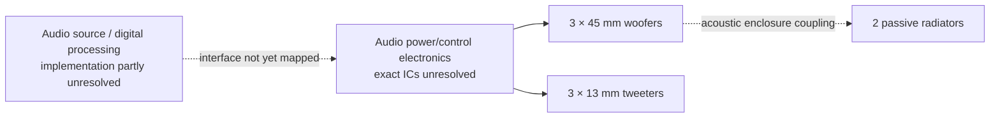
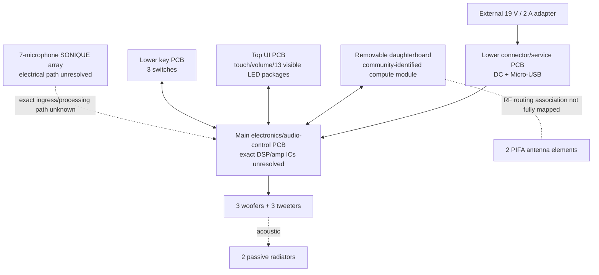

# Harman Kardon Invoke — Canonical Hardware Baseline

## 1. Identity and published product specifications

| Property | Value | Status | Evidence |
|---|---|---|---|
| Product | Harman Kardon Invoke | confirmed | [HARMAN-SPEC] |
| FCC ID | `APIHKINVOKE` | confirmed | [FCC-INDEX] |
| FCC product code/model | `HKINVOKE` | confirmed | [FCC-INDEX] |
| FCC equipment description | Wireless Speaker | confirmed | [FCC-INDEX] |
| Dimensions | 107 mm diameter × 242 mm height | confirmed | [HARMAN-SPEC] |
| Product weight | 1 kg / 2.3 lb | confirmed as published spec | [HARMAN-SPEC] |
| Rated power | 40 W | confirmed as published product rating | [HARMAN-SPEC] |
| Frequency response | 60 Hz–20 kHz, -6 dB | confirmed as published spec | [HARMAN-SPEC] |
| Power input | 19 VDC / 2 A | confirmed | [HARMAN-SPEC], [FCC-BT p.6] |
| Wi-Fi | 802.11 b/g/n/ac, 2.4/5 GHz | confirmed | [HARMAN-SPEC], [FCC-INDEX] |
| Bluetooth | 4.1 | confirmed | [HARMAN-SPEC], [FCC-BT p.6] |

Do not reinterpret the 40 W product rating as per-channel amplifier power or continuous supply draw; Harman's source does not specify the rating convention. [HARMAN-SPEC]

## 2. Acoustic hardware

### 2.1 Driven transducers

The manufacturer specifies:
- 3 × 45 mm (1.75 in) woofers;
- 3 × 13 mm (0.5 in) dome tweeters. [HARMAN-SPEC]

Harman separately states that the product uses two passive radiators. [HARMAN-NEWS]

Therefore the published acoustic moving-element inventory is:

```yaml
electrically_driven:
  woofers: 3
  tweeters: 3
passive:
  passive_radiators: 2
```

This does **not** establish:
- driver impedance;
- individual amplifier-channel count;
- individual channel power;
- crossover frequency;
- DSP topology.

Those remain unknown.

### 2.2 Acoustic architecture diagram



Evidence for the driver counts and radiators: [HARMAN-SPEC], [HARMAN-NEWS].  
The internal signal/control topology shown with dashed lines is intentionally unresolved.

## 3. Microphones and user interface

### 3.1 Microphone array

The owner's manual states that Invoke's SONIQUE microphone system contains **7 high-sensitivity microphones** intended for far-field speech capture. [HARMAN-OM p.8]

Harman's launch material states that SONIQUE uses beam forming, echo cancellation, and noise reduction algorithms. [HARMAN-NEWS]

What is **not established**:
- microphone manufacturer;
- microphone model;
- analog vs PDM/digital signaling;
- ADC location;
- sample rate/bit depth;
- raw channel accessibility;
- whether beamforming executes on the application SoC, a dedicated audio processor, or another subsystem.

### 3.2 Top UI

Manufacturer documentation establishes:
- a touch panel;
- a volume control ring;
- top illumination/status behavior. [HARMAN-OM pp.7-9]

FCC internal photo page 6 shows a circular top PCB with **13 visible LED packages: 12 around the perimeter and 1 central package**. This is a direct visual count, not a statement about LED color capability or protocol. [FCC-IP p.6]

FCC page 6 also visibly shows a rotary mechanical component on the opposite side of the top PCB. It is consistent with the manufacturer's volume ring, but the exact encoder part and signaling are unresolved. [FCC-IP p.6], [HARMAN-OM p.8]

### 3.3 Lower controls and service connector

The owner's manual documents:
- microphone on/off button;
- Bluetooth pairing button;
- factory-reset pin;
- power connector;
- Micro-USB connector identified as factory-service-only. [HARMAN-OM pp.7-8]

FCC internal photos show:
- a small lower connector PCB containing a Micro-USB receptacle and barrel-style DC connector; [FCC-IP p.7]
- a separate lower key PCB with three physical switch mechanisms. [FCC-IP p.8]

Observed PCB silkscreen strings visible in the FCC photography include:
- `40-HKTANA-CNB2G` on the connector board; [FCC-IP p.7]
- `40-HKTANA-KYB2G` on the key board. [FCC-IP p.8]

These are **board markings**, not proven Harman service part numbers.

## 4. External power

FCC Bluetooth test report `SZEM170300200801` records:
- adapter model: `DT19V-2C-DC`;
- input: AC 100–240 V, 50/60 Hz, 1.5 A max;
- output: DC 19 V, 2.0 A. [FCC-BT p.6]

### Deterministic inference: nominal adapter output

```text
19 V × 2.0 A = 38 W
```

Therefore the adapter's nominal output rating is 38 W. This is a `DERIVED` value from the regulatory voltage/current ratings, not a measured steady-state draw. [FCC-BT p.6]

FCC internal photo page 9 shows the external AC/DC supply's internal switch-mode power components. [FCC-IP p.9]

## 5. Wireless subsystem

### 5.1 Wi-Fi

Manufacturer spec:
- IEEE 802.11 b/g/n/ac;
- 2.4 GHz and 5 GHz. [HARMAN-SPEC]

FCC grant material additionally records:
- 2.4 GHz grant ranges including 2412–2462 MHz and 2422–2452 MHz;
- 5 GHz operation across multiple U-NII ranges;
- 20/40 MHz modes for relevant Part 15C grant;
- 20/40/80 MHz modes for the 5 GHz U-NII grant. [FCC-INDEX]

This establishes that Invoke was certified for 80 MHz channel bandwidth in the applicable 5 GHz modes. [FCC-INDEX]

### 5.2 Bluetooth

The FCC Bluetooth report states:
- Bluetooth 4.1 Dual Mode;
- 2402–2480 MHz;
- the cited report covers Bluetooth Classic;
- FHSS;
- GFSK, π/4-DQPSK, and 8DPSK;
- 79 channels;
- Adaptive Frequency Hopping;
- sample type: fixed production. [FCC-BT p.6]

### 5.3 Antennas

The same report states:
- antenna type: PIFA;
- Antenna 1 gain: 2.10 dBi;
- Antenna 2 gain: 2.29 dBi. [FCC-BT p.6]

FCC internal photo page 3 shows two cabled antenna elements attached to the electronics assembly. [FCC-IP p.3]

No claim is made here about simultaneous MIMO behavior because the cited evidence does not by itself prove the operating spatial-stream topology.

### 5.4 Exact radio IC

RAM-native Linux enumerated Marvell SDIO functions `02df:9135`,
`02df:9136`, and `02df:9137`. The acquired Invoke kernel source maps `9135`
to its SD8887 Wi-Fi driver and `9136` to its SD8887 Bluetooth driver. Both
drivers loaded their corresponding controller firmware on the physical unit.
[NATIVE-RAM]

This establishes the 88W8887/SD8887 radio family and SDIO host bus. The exact
package marking and simultaneous spatial-stream topology remain unknown.

## 6. Board/module architecture

FCC internal photography establishes multiple physically separate assemblies:
- lower connector/service PCB; [FCC-IP p.1, p.7]
- lower key PCB; [FCC-IP p.8]
- main electronics/audio-control PCB; [FCC-IP pp.3-4]
- a removable daughterboard connected through two long board-to-board connectors; [FCC-IP p.5]
- top UI/LED PCB; [FCC-IP p.6]
- two antenna elements; [FCC-IP p.3]

A community reverse-engineering report identifies the removable daughterboard as the compute module and identifies its platform as Marvell `88DE3006 (BG2CDP)`. [HKHACK]

### Physical architecture model



This is a **subsystem diagram**, not a schematic. Where the exact signal path is not established, dashed lines are used.

## 7. Compute platform

### 7.1 Invoke-specific identification status

The strongest currently cataloged Invoke-specific source for the application processor identity is the `HKHacking` reverse-engineering discussion. A contributor reports that the compute module is a **Marvell 88DE3006 (BG2CDP)** and that firmware references `berlin2cdp-dongle`. [HKHACK]

This is credible direct reverse-engineering evidence, but it is not manufacturer documentation and the present corpus has not independently read the package marking from a higher-resolution board image.

Status:
```yaml
invoke_soc_identity:
  value: "Marvell 88DE3006 / BG2CDP"
  status: observed_third_party
  confidence: medium_high
```

### 7.2 Silicon facts conditional on that identity

Linux kernel documentation states:
- `88DE3006` product family: Armada 1500 Mini Plus;
- design name: `BG2CDP`;
- CPU: dual-core ARM Cortex-A7. [LINUX-MARVELL]

Therefore:

> **If the Invoke-specific 88DE3006 identification is correct, dual Cortex-A7 is a direct silicon property, not a cross-device analogy.**

The canonical corpus does **not** currently state an Invoke CPU clock because the Harman configuration has not been established by runtime data or manufacturer documentation.

### 7.3 RAM

U-Boot `bdinfo` reports one 512 MiB DRAM bank at base `0x00000000`.
[NATIVE-RAM] External memory packages are visible on the daughterboard, but
the present regulatory image quality is not sufficient to establish exact DRAM
type or part number. [FCC-IP p.5]

Canonical state:

```yaml
ram_capacity: 512 MiB
ram_type: unknown
ram_part_number: unknown
```

## 8. Boot/service behavior

Harman's final release notes state:
- final software version `12.2314.0`;
- release date 2021-09-08;
- update medium: USB software flash tool;
- Windows driver installation is required so the PC can recognize and communicate with the Invoke. [HARMAN-FINAL]

This independently confirms that the service USB path was used for official firmware maintenance. [HARMAN-FINAL], [HARMAN-OM p.8]

The project has independently reproduced:

* Interactive U-Boot over the Micro-USB Marvell endpoint
* A custom RAM-only PID 1 and root ADB gadget
* A complete logical NAND data read
* Native SD8887 Wi-Fi and partial Bluetooth bring-up
* Real MCU/I2C startup under the custom lifecycle

See [NATIVE-RAM].

## 9. Nonvolatile storage

A third-party Invoke shell dump reports the map below. [HKHACK lines 218-236]
Its 512 MiB flashing-bundle partition layout does not match the physical unit
measured by this project.

```text
dev:    size     erasesize name
mtd0:  00020000 00020000 "block0"
mtd1:  00100000 00020000 "pre-bootloader"
mtd2:  00160000 00020000 "env"
mtd3:  00080000 00020000 "aligned"
mtd4:  00200000 00020000 "post-bootloader"
mtd5:  00200000 00020000 "post-bootloader"
mtd6:  01000000 00020000 "factory_setting"
mtd7:  01000000 00020000 "tz_en"
mtd8:  01000000 00020000 "tz_en-B"
mtd9:  01000000 00020000 "bootimgs"
mtd10: 01000000 00020000 "bootimgs-B"
mtd11: 0a900000 00020000 "rootfs"
mtd12: 00000000 00000000 "app"
mtd13: 00000000 00000000 "localstorage"
mtd14: 00000000 00000000 "BDlocalstorage"
mtd15: 00000000 00000000 "bbt"
mtd16: 10000000 00020000 "mv_nand"
```

### Deterministic inference: aggregate NAND address space

`0x10000000` bytes = 268,435,456 bytes = **256 MiB**.

Thus the reported aggregate `mv_nand` MTD device has a 256 MiB address space. [HKHACK lines 218-236]

Direct U-Boot and Linux observations confirm a Toshiba-manufactured 256 MiB
NAND with 2 KiB pages and 128 KiB erase blocks. A complete
268,435,456-byte ECC-processed logical data image was captured through a
kernel-enforced read-only MTD node. [NATIVE-RAM]

A second community project records a compact 256 MiB partition map with an
8 MiB `kernel` region beginning at `0x00a20000` and a 105 MiB `rootfs` region
beginning at `0x01220000`. [ARISTODDLE-INVOKE] The directly carved
high-entropy kernel container begins at `0x00a20000`, and the active SquashFS
at `0x02920000` falls inside that proposed rootfs region. This corroborates the
compact map's geometry without independently proving every partition label.

This does **not** prove:
- flash manufacturer;
- flash part number;
- NAND cell type;
- that every byte is available to userspace;
- exact bad-block/reserved-area behavior.

The `0x20000` erase size shown for the aggregate device equals 131,072 bytes = **128 KiB**. [HKHACK lines 218-236]

The duplicated names (`post-bootloader`, `tz_en`/`tz_en-B`, `bootimgs`/`bootimgs-B`) are suggestive of redundancy, but the exact selection/recovery semantics are **not established** and are not asserted as fact.

## 10. Filesystem observations

The `HKHacking` discussion reports that several MTD block devices were mounted read-only as YAFFS2 and that some blocks did not mount as YAFFS2. It also reports SquashFS structures in the flash/update investigation. [HKHACK]

Canonical interpretation:

> Filesystem type must be recorded **per image or partition**. Do not summarize the entire Invoke storage as "YAFFS2" or "SquashFS."

## 11. What is explicitly unknown

```yaml
compute:
  configured_cpu_clock: unknown
  ram_type: unknown
  ram_part_number: unknown
  daughterboard_connector_pinout: unknown

storage:
  nand_part_number: unknown
  bad_block_strategy: unknown

radio:
  spatial_stream_topology: unknown

audio:
  audio_dsp: unknown
  amplifier_ic: unknown
  amplifier_topology: unknown
  codec_adc_dac: unknown
  digital_audio_bus: unknown
  speaker_impedances: unknown
  crossover: unknown

microphones:
  microphone_part_number: unknown
  electrical_interface: unknown
  adc_location: unknown
  raw_channel_access: unknown

ui:
  led_driver: unknown
  led_protocol: unknown
  touch_controller: unknown
  rotary_encoder_part: unknown

debug:
  uart_pinout: unknown
  jtag_swd_status: unknown
  test_pad_map: unknown
```

## 12. Strategic conclusion supported by present evidence

The most important established architectural fact for repurposing is that the Invoke contains multiple separable PCBs and a removable daughterboard connected to the main electronics through two board-to-board connectors. [FCC-IP pp.4-5]

A credible third-party hardware/firmware investigation identifies that daughterboard as the Marvell BG2CDP compute module. [HKHACK]

Therefore the highest-value unresolved problem is:

> **Map the daughterboard-to-main-board electrical/protocol boundary.**

This is a research priority, not a claim that the main audio board can already be independently controlled.

# Bibliography

## HARMAN-SPEC
HARMAN International Industries, *Harman Kardon Invoke Specification Sheet*, 2017.  
https://www.harmankardon.com/on/demandware.static/-/Sites-masterCatalog_Harman/default/dwf63bd00a/pdfs/HK_Invoke_Spec_Sheet_English.pdf

## HARMAN-OM
HARMAN International Industries, *Harman Kardon Invoke Owner's Manual*. Particularly pp.7-9 and p.36.  
https://support.harmankardon.com/on/demandware.static/-/Sites-masterCatalog_Harman/default/dwdac694e8/pdfs/Harman%20Kardon%20Invoke%20Owners%20Manual.pdf

## HARMAN-NEWS
HARMAN, *HARMAN Reveals the Harman Kardon Invoke Intelligent Speaker with Cortana from Microsoft*, 2017-10-02.  
https://news.harman.com/releases/harman-reveals-the-harman-kardon-invokeTM-intelligent-speaker-with-cortana-from-microsoft

## HARMAN-FINAL
Harman Audio Support, *INVOKE: Final Software Update & Release Notes*, release 12.2314.0, 2021-09-08.  
https://support.harmanaudio.com/howto/invoke-final-software-update-release-notes-us/000018514.html

## FCC-INDEX
FCC ID `APIHKINVOKE`, filing/exhibit index and grants.  
https://fccid.io/APIHKINVOKE

## FCC-IP
SGS/Harman, *Internal Photos*, FCC document ID 3374744, 9 pages.  
https://fccid.io/APIHKINVOKE/Internal-Photos/Internal-Photos-3374744.pdf  
Filing-index SHA-256: `bd9ad8dbda90b5ae76454a06545369b75b79b19265896388414e80b64d56ef61`

## FCC-BT
SGS-CSTC, report `SZEM170300200801`, FCC Bluetooth test exhibit 3374512, 151 pages. Particularly p.6.  
https://fccid.io/APIHKINVOKE/Test-Report/Test-report-3374512.pdf

## HKHACK
`coggy9/HKHacking`, Discussion #3, *Harman.Kardon.INVOKE.Flashing.zip*, 2021.  
https://github.com/coggy9/HKHacking/discussions/3  
Relevant visible discussion locators include lines 143-180 and 218-238 in the indexed rendering.

## LINUX-MARVELL
Linux kernel documentation, *ARM Marvell SoCs — Berlin family*.  
https://docs.kernel.org/5.19/arm/marvell.html

## NATIVE-RAM

Project-local hardware observations and hashes in
`docs/native-ram-platform.md` and
`reinvoke-archive/hardware/dumps/20260902T215700Z-native-ram/`.

## ARISTODDLE-INVOKE

`Aristoddle/hk-invoke-opensource-speaker`, commit
`948e85e2ddbdd560e186913cdfaad3f57f118c93`. The source is retained as
provisional; see `docs/research/provisional/aristoddle-invoke-review.md`.
