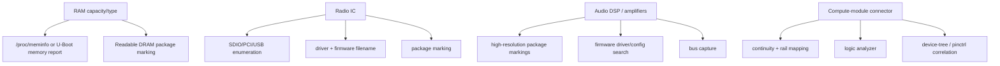

# Claim and Evidence Ledger

## How to use this document

Each row is intentionally atomic. An LLM should prefer the row's `status` and `evidence_class` over conversational recollection.

`confirmed` means the statement itself is directly supported.  
`observed` means it was directly seen/reported from Invoke hardware but may be third-party.  
`derived` means the premises are cited and the inference is deterministic.  
`hypothesis` means do not repeat as fact.  
`unknown` means preserve the unknown.

## Product / mechanical

| Claim ID | Statement | Status | Evidence class | Confidence | Source locator |
|---|---|---|---|---|---|
| HKI-ID-001 | FCC ID is `APIHKINVOKE`. | confirmed | REG | high | [FCC-INDEX] |
| HKI-ID-002 | FCC product code/model is `HKINVOKE`. | confirmed | REG | high | [FCC-INDEX] |
| HKI-MECH-001 | Published dimensions are 107 × 242 mm (D × H). | confirmed | MFG | high | [HARMAN-SPEC] |
| HKI-MECH-002 | Published product weight is 1 kg / 2.3 lb. | confirmed | MFG | high | [HARMAN-SPEC] |
| HKI-MECH-003 | Device uses several physically separate PCBs/modules. | observed | OBS-PHOTO | high | [FCC-IP pp.1,3-8] |
| HKI-MECH-004 | A removable rectangular daughterboard connects through two long board-to-board connectors. | observed | OBS-PHOTO | high | [FCC-IP pp.4-5] |

## Power

| Claim ID | Statement | Status | Evidence class | Confidence | Source locator |
|---|---|---|---|---|---|
| HKI-PWR-001 | Product supply is 19 VDC, 2 A. | confirmed | MFG+REG | high | [HARMAN-SPEC], [FCC-BT p.6] |
| HKI-PWR-002 | FCC-tested adapter model is `DT19V-2C-DC`. | confirmed | REG | high | [FCC-BT p.6] |
| HKI-PWR-003 | Adapter input is AC100–240 V, 50/60 Hz, 1.5 A max. | confirmed | REG | high | [FCC-BT p.6] |
| HKI-PWR-004 | Nominal adapter output rating is 38 W. | derived | DERIVED | high | 19 V × 2 A from [FCC-BT p.6] |
| HKI-PWR-005 | External adapter contains switch-mode power components visible in FCC photos. | observed | OBS-PHOTO | high | [FCC-IP p.9] |

## Acoustic hardware

| Claim ID | Statement | Status | Evidence class | Confidence | Source locator |
|---|---|---|---|---|---|
| HKI-AUD-001 | Invoke contains 3 × 45 mm woofers. | confirmed | MFG | high | [HARMAN-SPEC] |
| HKI-AUD-002 | Invoke contains 3 × 13 mm dome tweeters. | confirmed | MFG | high | [HARMAN-SPEC] |
| HKI-AUD-003 | Invoke contains 2 passive radiators. | confirmed | MFG | high | [HARMAN-NEWS] |
| HKI-AUD-004 | Published rated power is 40 W. | confirmed | MFG | high | [HARMAN-SPEC] |
| HKI-AUD-005 | Published frequency response is 60 Hz–20 kHz (-6 dB). | confirmed | MFG | high | [HARMAN-SPEC] |
| HKI-AUD-006 | Exact amplifier IC(s) are known. | unknown | UNKNOWN | high | no sufficient evidence |
| HKI-AUD-007 | Amplifier topology is Class-D. | hypothesis | HYP | low | visual plausibility is insufficient |
| HKI-AUD-008 | Exact audio DSP is known. | unknown | UNKNOWN | high | no sufficient evidence |
| HKI-AUD-009 | Exact codec/ADC/DAC path is known. | unknown | UNKNOWN | high | no sufficient evidence |
| HKI-AUD-010 | Driver impedances are known. | unknown | UNKNOWN | high | no measurement/source |

## Microphones / UI

| Claim ID | Statement | Status | Evidence class | Confidence | Source locator |
|---|---|---|---|---|---|
| HKI-MIC-001 | Invoke uses a 7-microphone SONIQUE system. | confirmed | MFG | high | [HARMAN-OM p.8], [HARMAN-NEWS] |
| HKI-MIC-002 | Harman describes SONIQUE as using beam forming, echo cancellation, and noise reduction. | confirmed as product feature | MFG | high | [HARMAN-NEWS] |
| HKI-MIC-003 | Microphone electrical interface is known. | unknown | UNKNOWN | high | no sufficient evidence |
| HKI-UI-001 | Product has a touch panel and volume control ring. | confirmed | MFG | high | [HARMAN-OM pp.7-9] |
| HKI-UI-002 | Top PCB has 13 visible LED packages: 12 peripheral + 1 center. | observed | OBS-PHOTO | high | [FCC-IP p.6] |
| HKI-UI-003 | Those 13 packages are individually-addressable RGB LEDs. | hypothesis | HYP | low | package appearance alone does not prove this |
| HKI-UI-004 | Top PCB has a visible rotary mechanical component. | observed | OBS-PHOTO | high | [FCC-IP p.6] |
| HKI-UI-005 | Lower key PCB has three physical switch mechanisms. | observed | OBS-PHOTO | high | [FCC-IP p.8] |
| HKI-UI-006 | Connector-board marking includes `40-HKTANA-CNB2G`. | observed | OBS-PHOTO | high | [FCC-IP p.7] |
| HKI-UI-007 | Key-board marking includes `40-HKTANA-KYB2G`. | observed | OBS-PHOTO | high | [FCC-IP p.8] |

## External/service interfaces

| Claim ID | Statement | Status | Evidence class | Confidence | Source locator |
|---|---|---|---|---|---|
| HKI-IO-001 | Product has a Micro-USB connector designated factory service only in the owner manual. | confirmed | MFG | high | [HARMAN-OM p.8] |
| HKI-IO-002 | FCC photo shows Micro-USB and DC barrel connector on a small lower PCB. | observed | OBS-PHOTO | high | [FCC-IP p.7] |
| HKI-IO-003 | Harman's final updater used a USB software flash tool. | confirmed | MFG | high | [HARMAN-FINAL] |
| HKI-IO-004 | Official update procedure installs a Windows driver so the PC can communicate with Invoke. | confirmed | MFG | high | [HARMAN-FINAL] |

## Radio

| Claim ID | Statement | Status | Evidence class | Confidence | Source locator |
|---|---|---|---|---|---|
| HKI-RF-001 | Wi-Fi supports 802.11 b/g/n/ac. | confirmed | MFG | high | [HARMAN-SPEC] |
| HKI-RF-002 | Wi-Fi supports 2.4 and 5 GHz. | confirmed | MFG+REG | high | [HARMAN-SPEC], [FCC-INDEX] |
| HKI-RF-003 | FCC 5 GHz grant includes 80 MHz bandwidth operation. | confirmed | REG | high | [FCC-INDEX] |
| HKI-RF-004 | Bluetooth is 4.1 Dual Mode. | confirmed | REG | high | [FCC-BT p.6] |
| HKI-RF-005 | Bluetooth Classic report lists GFSK, π/4-DQPSK, 8DPSK, 79 channels, AFH. | confirmed | REG | high | [FCC-BT p.6] |
| HKI-RF-006 | Antenna type is PIFA. | confirmed | REG | high | [FCC-BT p.6] |
| HKI-RF-007 | Antenna gains are 2.10 dBi and 2.29 dBi. | confirmed | REG | high | [FCC-BT p.6] |
| HKI-RF-008 | FCC photo shows two cabled antenna elements. | observed | OBS-PHOTO | high | [FCC-IP p.3] |
| HKI-RF-009 | Exact radio combo IC is 88W8887. | hypothesis | HYP | low-medium | related-platform similarity only; no Invoke-specific proof in current corpus |
| HKI-RF-010 | Invoke uses 2×2 MIMO. | unknown | UNKNOWN | high | two antennas do not alone establish stream topology |

## Compute

| Claim ID | Statement | Status | Evidence class | Confidence | Source locator |
|---|---|---|---|---|---|
| HKI-COMP-001 | Community reverse engineering identifies the daughterboard compute platform as Marvell 88DE3006 / BG2CDP. | observed | OBS-RUNTIME-3P | medium-high | [HKHACK] |
| HKI-COMP-002 | 88DE3006 is Armada 1500 Mini Plus, design name BG2CDP. | confirmed for silicon | SILICON | high | [LINUX-MARVELL] |
| HKI-COMP-003 | 88DE3006 contains dual ARM Cortex-A7 CPU cores. | confirmed for silicon | SILICON | high | [LINUX-MARVELL] |
| HKI-COMP-004 | Invoke's configured CPU clock is 1.2 GHz. | hypothesis | HYP | low | no Invoke-specific clock evidence in current corpus |
| HKI-COMP-005 | Exact Invoke RAM capacity is known. | unknown | UNKNOWN | high | no direct proof |
| HKI-COMP-006 | RAM is definitely DDR3L. | hypothesis | HYP | low | no direct Invoke-specific proof |
| HKI-COMP-007 | Daughterboard connector pinout is known. | unknown | UNKNOWN | high | no published mapping in current corpus |

## Boot and storage

| Claim ID | Statement | Status | Evidence class | Confidence | Source locator |
|---|---|---|---|---|---|
| HKI-BOOT-001 | Third-party researchers report successfully reaching U-Boot on Invoke. | observed | OBS-RUNTIME-3P | medium-high | [HKHACK lines 159-180] |
| HKI-BOOT-002 | Third-party researchers report ADB shell access. | observed | OBS-RUNTIME-3P | medium-high | [HKHACK lines 159-180] |
| HKI-STOR-001 | Third-party `/proc/mtd` output reports aggregate `mv_nand` size `0x10000000`. | observed | OBS-RUNTIME-3P | medium-high | [HKHACK lines 218-236] |
| HKI-STOR-002 | `0x10000000` bytes equals 256 MiB. | derived | DERIVED | high | arithmetic from HKI-STOR-001 |
| HKI-STOR-003 | MTD erase size `0x20000` equals 128 KiB. | derived | DERIVED | high | arithmetic from [HKHACK lines 218-236] |
| HKI-STOR-004 | Physical NAND manufacturer/part number is known. | unknown | UNKNOWN | high | no sufficient evidence |
| HKI-STOR-005 | Duplicate `bootimgs`/`bootimgs-B` proves Android-style A/B slots. | hypothesis | HYP | low | names imply redundancy but semantics are unproven |
| HKI-STOR-006 | Some MTD blocks were reportedly mountable as YAFFS2. | observed | OBS-RUNTIME-3P | medium | [HKHACK] |
| HKI-STOR-007 | Entire device storage is YAFFS2. | contradicted / do-not-use | — | high | same discussion reports blocks that did not mount as YAFFS2 and SquashFS content elsewhere |

## Contradiction / caution register

### C-001: exact SoC confidence

The present corpus has:
- Invoke-specific community identification: `88DE3006 / BG2CDP`; [HKHACK]
- exact Linux silicon documentation for that identifier; [LINUX-MARVELL]
- FCC photographs of a compute-class daughterboard, but current image resolution has not been used to independently transcribe the package marking. [FCC-IP p.5]

**Policy:** retain `medium-high` for the Invoke-specific chip identity until a package marking, runtime CPU ID, device tree, or firmware metadata is archived directly.

### C-002: related-platform component leakage

A number of BG2CDP products use familiar radio and memory components. That does **not** establish those components in Invoke.

**Policy:** all such component names remain hypotheses unless Invoke-specific evidence is added.

### C-003: "40 W" vs 38 W adapter

No contradiction is established. One is a published audio-system rating; the other is the adapter's nominal V×A rating. Their definitions are not identical.

## Unresolved evidence targets

# Bibliography

## HARMAN-SPEC
HARMAN International Industries, *Harman Kardon Invoke Specification Sheet*, 2017.  
https://www.harmankardon.com/on/demandware.static/-/Sites-masterCatalog_Harman/default/dwf63bd00a/pdfs/HK_Invoke_Spec_Sheet_English.pdf

## HARMAN-OM
HARMAN International Industries, *Harman Kardon Invoke Owner's Manual*.  
https://support.harmankardon.com/on/demandware.static/-/Sites-masterCatalog_Harman/default/dwdac694e8/pdfs/Harman%20Kardon%20Invoke%20Owners%20Manual.pdf

## HARMAN-NEWS
HARMAN, *HARMAN Reveals the Harman Kardon Invoke Intelligent Speaker with Cortana from Microsoft*, 2017-10-02.  
https://news.harman.com/releases/harman-reveals-the-harman-kardon-invokeTM-intelligent-speaker-with-cortana-from-microsoft

## HARMAN-FINAL
Harman Audio Support, *INVOKE: Final Software Update & Release Notes*, 2021-09-08.  
https://support.harmanaudio.com/howto/invoke-final-software-update-release-notes-us/000018514.html

## FCC-INDEX
FCC ID `APIHKINVOKE`.  
https://fccid.io/APIHKINVOKE

## FCC-IP
*Internal Photos*, FCC document ID 3374744.  
https://fccid.io/APIHKINVOKE/Internal-Photos/Internal-Photos-3374744.pdf  
SHA-256 reported by filing index: `bd9ad8dbda90b5ae76454a06545369b75b79b19265896388414e80b64d56ef61`

## FCC-BT
SGS-CSTC, `SZEM170300200801`, FCC Bluetooth test report.  
https://fccid.io/APIHKINVOKE/Test-Report/Test-report-3374512.pdf

## HKHACK
`coggy9/HKHacking`, Discussion #3, 2021.  
https://github.com/coggy9/HKHacking/discussions/3

## LINUX-MARVELL
Linux kernel documentation, *ARM Marvell SoCs — Berlin family*.  
https://docs.kernel.org/5.19/arm/marvell.html
