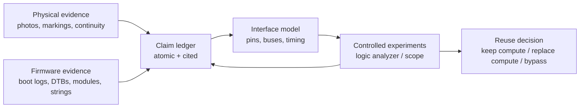
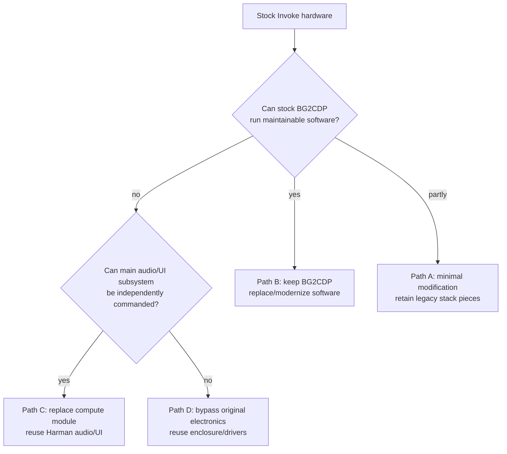

# Research Framework and Rubber-Duck Critique

## 1. Reframing the goal

"Full hardware specification" can mean two different things:

1. **descriptive completeness** — identify every component, value, net, connector, and physical parameter;
2. **repurposing completeness** — know enough interfaces to control or replace the useful subsystems.

The Invoke has multiple separate boards, including a removable daughterboard attached to the main electronics through two board-to-board connectors. [FCC-IP pp.4-5] Community reverse engineering identifies that daughterboard as the BG2CDP compute module. [HKHACK]

That makes **interface discovery** more valuable than a purely encyclopedic BOM.

## 2. Recommended corpus/research structure



The `Claim ledger` is deliberately central. This prevents a plausible guess from being repeated enough times that it becomes pseudo-fact.

## 3. Completeness levels

A practical stopping framework:

```yaml
L0_product:
  goal: manufacturer and regulatory specifications

L1_architecture:
  goal: board inventory, major IC identities, memory, radios, power domains

L2_interfaces:
  goal: connector pinouts, buses, clocks, resets, control protocols, audio transport

L3_schematic:
  goal: component values, rails, nets, detailed electrical reconstruction

L4_characterization:
  goal: measured timing, acoustic performance, power behavior, RF behavior
```

For repurposing, **L2 is the critical threshold**. L3/L4 are useful but not prerequisites if the stock audio/UI subsystems can be commanded successfully.

## 4. Workstreams

### A. Sample and revision control

Before invasive work, assign a sample ID:

```yaml
sample_id: HKI-SAMPLE-001
model: HKINVOKE
fcc_id: APIHKINVOKE
firmware_version: unknown
external_label_photos: []
board_revisions: []
acquisition_history: unknown
```

Capture:
- exterior labels;
- firmware version;
- every PCB silkscreen/revision;
- compute daughterboard markings;
- PSU label;
- hashes of all dumps.

Why: FCC images establish at least one production/certification configuration, not proof that every retail production run is electrically identical. [FCC-IP], [FCC-BT]

### B. Physical board census

Create one record per PCB:
- board ID;
- silkscreen;
- both-side photos;
- dimensions;
- connectors;
- IC markings;
- crystals/oscillators;
- test pads;
- power inductors/regulators;
- cable destinations.

Do not identify an IC from package shape alone.

### C. Firmware census

The existing community work demonstrates U-Boot and ADB access paths and exposes a useful MTD map. [HKHACK] The next high-yield acquisition should collect:

```text
/proc/cpuinfo
/proc/meminfo
/proc/mtd
/proc/interrupts
/proc/iomem
/proc/device-tree/
/sys/bus/*/devices
/sys/class/sound
/proc/asound
dmesg
lsmod
mount
fw_printenv  (if safe/available)
```

Also extract:
- DTBs;
- kernel config;
- init scripts;
- ALSA machine drivers;
- I2C/SPI registrations;
- firmware blobs;
- pinctrl names;
- radio firmware filenames;
- daemon names that control LEDs/audio/microphones.

This can resolve several hardware identities without desoldering anything.

### D. Connector/interface census

Highest priority: removable daughterboard ↔ main PCB. [FCC-IP pp.4-5]

For every connector pin, record:
- continuity to ground;
- idle voltage;
- supply voltage;
- direction;
- boot-stage activity;
- user-action-correlated activity;
- likely bus;
- source/destination IC.

Potential interfaces to test, **not assume**:
- I2C;
- SPI;
- UART;
- I2S/TDM;
- USB;
- GPIO;
- clocks;
- reset/interrupt lines.

### E. Dynamic bus capture

Correlate activity with controlled events:
- cold boot;
- Bluetooth pairing;
- rotate volume one detent;
- tap top panel;
- mute/unmute microphone;
- play a 1 kHz tone;
- play silence;
- start official update mode.

Behavioral correlation can identify a bus before the controlled IC is identified.

## 5. Priority backlog

### P0 — Preserve and fingerprint a stock sample

Deliverables:
- partition dumps;
- SHA-256 hashes;
- U-Boot environment;
- complete boot log;
- firmware version;
- board photos and revisions.

This must precede destructive work.

### P0 — Establish exact RAM

Current baseline: unknown. [CANONICAL BASELINE]

Best routes:
1. `/proc/meminfo`;
2. U-Boot memory report;
3. device-tree memory node;
4. readable DRAM marking.

A related Chromecast or Google Home configuration is not evidence for Invoke RAM size.

### P0 — Establish exact radio IC

Current baseline: unknown.

Best routes:
1. `dmesg`;
2. bus enumeration;
3. kernel driver;
4. firmware filename;
5. package marking.

Do not start from "probably 88W8887" and search only for confirming evidence.

### P0 — Map daughterboard connector

This is the highest-value hardware target because FCC photography establishes a separable board boundary. [FCC-IP pp.4-5]

Success criteria:
- pin count and numbering;
- all grounds;
- all power rails;
- reset/enable;
- clock(s);
- digital audio path(s);
- control bus(es);
- USB/service relationship;
- interrupt/GPIO lines.

### P0 — Identify audio-control silicon and transport

Current exact DSP/amplifier/codec identities are unknown.

Use:
- package markings;
- firmware driver strings;
- ALSA topology;
- bus capture.

Success criterion:
> determine what digital/control traffic must be reproduced to make the stock acoustic system play controlled audio.

### P1 — Map microphone path

Seven microphones are manufacturer-confirmed. [HARMAN-OM p.8]

Need:
- part marking/type;
- electrical signaling;
- ADC/decimation ownership;
- clock source;
- channel order.

Success criterion:
> capture the seven channels, or document precisely where/why raw channels become inaccessible.

### P1 — Reverse top UI

FCC photo establishes 13 visible LED packages and a rotary mechanical component; manufacturer documentation establishes touch/volume behavior. [FCC-IP p.6], [HARMAN-OM pp.7-9]

Need:
- touch controller identity;
- encoder signaling;
- LED driver identity;
- bus/control protocol.

Success criterion:
- set an arbitrary light pattern;
- read touch/rotation independently of the original Cortana application.

### P1 — Power map

Need:
- 19 V input path;
- standby rail(s);
- compute-module rail(s);
- logic rails;
- audio power rail(s);
- sequencing/enable signals.

Do not infer rail values from common design practice without measurement.

## 6. Modification decision tree



The lettering is only a planning convention, not a recommendation.

## 7. Rubber-duck critique

### Critique 1 — "Every last detail" has no natural endpoint

A resistor-level netlist is still incomplete if magnet geometry, microphone tolerances, speaker Thiele/Small parameters, and firmware-calibrated coefficients are omitted.

**Correction:** target completeness by level (L0–L4), not by rhetoric.

### Critique 2 — The earlier effort risked laundering platform analogies into Invoke facts

Examples of dangerous reasoning:
- "BG2CDP devices often have 512 MB, therefore Invoke has 512 MB."
- "Google Home uses 88W8887, therefore Invoke does."
- "The board looks like Class-D, therefore it is."

**Correction:** related-platform evidence belongs in a hypothesis queue and must be independently verified.

### Critique 3 — We should prioritize interfaces over IC names

Knowing an audio DSP part number is useful. Knowing the exact bus sequence that initializes it and sends audio is often more useful.

Pair every component question with an interface question.

Bad:
> What is U17?

Better:
> What is U17, which connector pins reach it, and what transactions occur when playback starts?

### Critique 4 — Raw artifacts must survive alongside summaries

Markdown conclusions alone are insufficient.

The eventual research corpus should archive:
- FCC PDFs;
- Harman manuals;
- official updater package where legally redistributable;
- boot logs;
- partition hashes;
- DTBs;
- board photos;
- logic-analyzer captures;
- package-marking crops.

Markdown should **index evidence**, not replace it.

### Critique 5 — Third-party runtime output is valuable but must be labeled

The `/proc/mtd`, U-Boot, and ADB evidence in `HKHacking` is much stronger than generic forum speculation because it purports to be direct device output. [HKHACK]

But it is still external evidence not yet reproduced on our own sample.

**Correction:** classify as `OBS-RUNTIME-3P`, not manufacturer-confirmed fact.

### Critique 6 — A/B semantics were previously at risk of overstatement

Paired names such as `bootimgs` / `bootimgs-B` make redundancy plausible, but they do not prove Android-style slot behavior. [HKHACK lines 218-236]

**Correction:** say "paired/duplicated regions; selection semantics unresolved."

### Critique 7 — 38 W adapter vs 40 W audio rating is not a contradiction

`19 V × 2 A = 38 W` is a supply rating. The 40 W figure is Harman's audio system rating. [FCC-BT p.6], [HARMAN-SPEC]

Without Harman defining how 40 W is measured, comparing the two as continuous-power identities is invalid.

### Critique 8 — The daughterboard boundary is strategically underexploited

FCC photographs show two board-to-board connectors between the small daughterboard and main board. [FCC-IP pp.4-5]

This creates a plausible future replacement-compute strategy, but **only after the interface is mapped**.

Do not leap from "modular PCB" to "easy SBC swap."

### Critique 9 — Preserve Harman's acoustic implementation if practical

The manufacturer deliberately engineered:
- six driven transducers;
- two passive radiators;
- seven microphones;
- 360-degree acoustic/voice behavior. [HARMAN-SPEC], [HARMAN-NEWS]

Replacing the electronics too early could discard useful tuning and integration.

Research sequence should be:
1. understand/control existing audio path;
2. only replace it if necessary.

## 8. Evidence gates

### Gate A — BG2CDP reuse viability

Required before choosing to keep the original compute module:
- exact RAM;
- repeatable bootloader recovery;
- kernel/toolchain path;
- usable audio interface;
- network strategy;
- storage reliability.

### Gate B — Replacement-compute viability

Required:
- connector pinout;
- rail/power sequencing;
- digital audio format;
- control protocol;
- UI protocol;
- microphone transport or alternate path.

### Gate C — Full electronics bypass

Choose only if:
- stock audio/control is not practically reusable;
- acoustic driver parameters are measured;
- a replacement crossover/DSP/amplifier design is justified.

## 9. Next concrete deliverables

Recommended next corpus additions:

1. `04_SAMPLE_RECORD_HKI-SAMPLE-001.md`
2. `05_BOARD_CENSUS.md`
3. `06_BOOT_FIRMWARE_MAP.md`
4. `07_CONNECTOR_PINOUTS.md`
5. `08_COMPONENT_IDENTIFICATION_LEDGER.md`
6. `09_BUS_CAPTURE_LOG.md`

These should keep the same evidence grammar and bibliography discipline as this corpus.

# Bibliography

## HARMAN-SPEC
HARMAN International Industries, *Harman Kardon Invoke Specification Sheet*, 2017.  
https://www.harmankardon.com/on/demandware.static/-/Sites-masterCatalog_Harman/default/dwf63bd00a/pdfs/HK_Invoke_Spec_Sheet_English.pdf

## HARMAN-OM
HARMAN International Industries, *Harman Kardon Invoke Owner's Manual*.  
https://support.harmankardon.com/on/demandware.static/-/Sites-masterCatalog_Harman/default/dwdac694e8/pdfs/Harman%20Kardon%20Invoke%20Owners%20Manual.pdf

## HARMAN-NEWS
HARMAN, *HARMAN Reveals the Harman Kardon Invoke Intelligent Speaker with Cortana from Microsoft*, 2017-10-02.  
https://news.harman.com/releases/harman-reveals-the-harman-kardon-invokeTM-intelligent-speaker-with-cortana-from-microsoft

## FCC-IP
SGS/Harman, *Internal Photos*, FCC document ID 3374744.  
https://fccid.io/APIHKINVOKE/Internal-Photos/Internal-Photos-3374744.pdf  
Filing-index SHA-256: `bd9ad8dbda90b5ae76454a06545369b75b79b19265896388414e80b64d56ef61`

## FCC-BT
SGS-CSTC, `SZEM170300200801`, FCC Bluetooth test report.  
https://fccid.io/APIHKINVOKE/Test-Report/Test-report-3374512.pdf

## HKHACK
`coggy9/HKHacking`, Discussion #3, *Harman.Kardon.INVOKE.Flashing.zip*, 2021.  
https://github.com/coggy9/HKHacking/discussions/3

## LINUX-MARVELL
Linux kernel documentation, *ARM Marvell SoCs — Berlin family*.  
https://docs.kernel.org/5.19/arm/marvell.html
