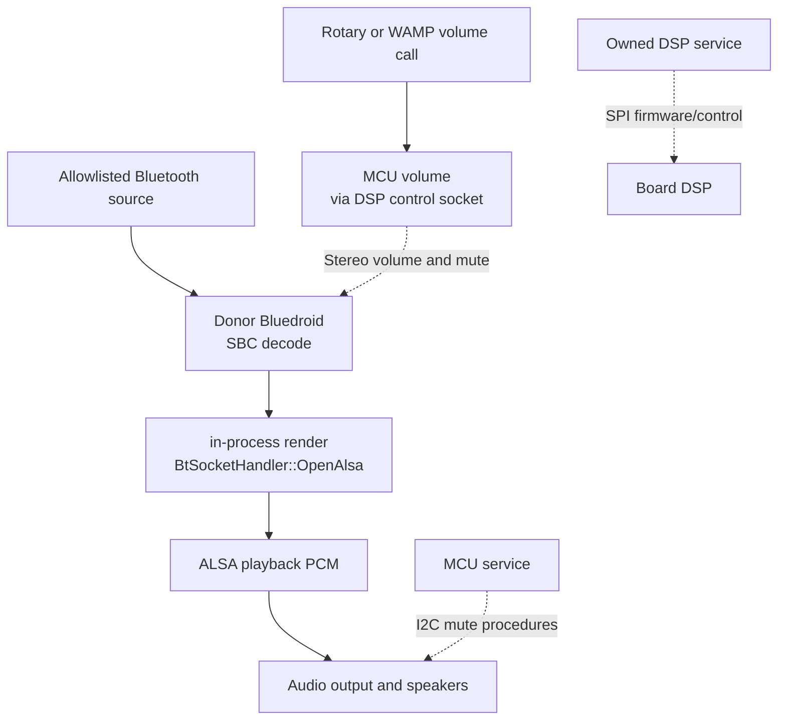

The donor Bluedroid stack carries Bluetooth audio; volume authority runs
inside the static ARM `reinvoke-mcu-interface`, not a second target-side music
service. An earlier design used BlueZ and patched BlueALSA in place of the
donor `music-source-manager` and `audio-ui`; both were removed in 225183e. The [current contract](../current-product-contract.md)
is normative; recovered donor calls are consolidated in
[control-plane emulation](control-plane-emulation.md#audio-and-source-contracts).

## State authority

| State              | Authority                                | WAMP projection                                      |
| ------------------ | ---------------------------------------- | ---------------------------------------------------- |
| Connected source   | Donor Bluedroid stack                    | Source `com.harman.bluetooth`                        |
| Transport/playback | Donor Bluedroid PCM lifecycle            | Bluetooth stream state and `com.harman.stateChanged` |
| Music volume       | MCU service over the DSP control socket  | Volume procedures and events                         |
| Amplifier/DAC mute | MCU service over I2C                     | `muteampcontrol`, `mutedaccontrol`                   |

The MCU handles physical rotary input before compatibility publication and
applies the level by calling `com.harman.dsp.volumeSet`, a plain WAMP
registration of the DSP service.

The DSP takes a single byte and percent is passed straight through. The scale
is not established as linear: the only measured points on this unit are 5 and
10 (comfortable) against 90 (loud), so levels are kept in that low range rather
than scaled to fill the byte.

An earlier design drove volume through BlueALSA's `org.bluealsa.PCM1.Volume`
and packed mute bits with 0-127 A2DP volumes into one `uint16`. BlueZ and
BlueALSA were removed in favour of the donor Bluedroid stack, so `bluealsa-cli`
does not ship and every volume request failed with `fork/exec
/opt/reinvoke/bin/bluealsa-cli: no such file or directory`. The connect-time
12 percent ceiling went with it; it existed only because a BlueALSA transport
arrived at full scale.

See [volume control](../../tools/mcu-interface/volume.go).

## PCM and speaker safety

This diagram describes software ownership and logical signal flow, not board
wiring. PCM samples follow ALSA, not the DSP service's SPI control channel.

There is no automatic speaker muting. The amplifier and DAC are opened once,
when the DSP accepts its first volume, and then stay open; they change only
through the `muteampcontrol` and `mutedaccontrol` procedures, and mute again
on shutdown. Nothing polls and nothing re-mutes.

Initialisation leaves them muted, which is what the donor does: its own log
line there reads `MCU init io expander. mute amp and dac!!!` and its
initialisation contains no unmute. The only `UnMuting AMP`/`UnMuting DAC`
sites in that binary are the `muteampcontrol` and `mutedaccontrol` handlers
and a power path, and `system-manager` is the only donor binary that calls
`muteampcontrol`. This runtime replaces `system-manager` with `/init`, so the
step it performed is performed here instead.

Opening them during initialisation was tried in 05.8.11 and reverted: it put
the amplifier live for DSP bootup and for the first gain change, both of which
were audible on this unit as pops during startup.

An earlier design polled ALSA every 100 ms and authorized physical unmute only
while a lease thread matched `owner_pid` and `/proc/<tid>/exe` resolved to one
packaged player, re-muting 1.5 seconds after that lapsed. That was this
project's invention rather than donor behaviour, and it silenced every sound
the runtime did not itself render, including the vendor's own startup chime.
It has been removed.

Initialization still mutes both while the IO expander is brought up, which is
what the donor does; its log line there reads `MCU init io expander. mute amp
and dac!!!`. See
[controller sequencing](../../tools/mcu-interface/controller.go).

## Host reference versus target

The dependency-free Node
[state core](../../tools/control/speaker-control-state.mjs),
[service](../../tools/control/speaker-control-service.mjs) and
[backend](../../tools/control/speaker-control-backend.mjs) test the compatibility
contract. One WAMP session registers eleven relevant procedures and subscribes
to rotary input. The core covers clamping, result shapes, event order and
source/stream state.

`--bluetooth-active` supplies a single-source test state without an adapter.
Reference rotary handling applies one logical percent per event, not a claimed
donor acceleration curve. The injectable backend requires an explicit PCM
path and source/transport observers; it serializes changes, synchronizes
stereo gain/mute and projects authoritative snapshots. That backend was
written against BlueALSA and is host-only; it has no counterpart on the
target since BlueALSA was removed.

The target applies volume through `com.harman.dsp.volumeSet` with coalesced
rotary updates. It runs neither Node.js nor the reference modules.

## Evidence boundary

Host tests and historical RAM runs exercise the safety implementation.
Candidate 02 separately demonstrated native attended sound and rotary volume.
Candidate 03 has connection/provisioning evidence, not a repeated acoustic
campaign. Native microphone capture/mic-mute acceptance remains open.
Candidate-specific results belong in the
[native NAND guide](../native-nand-platform.md).
