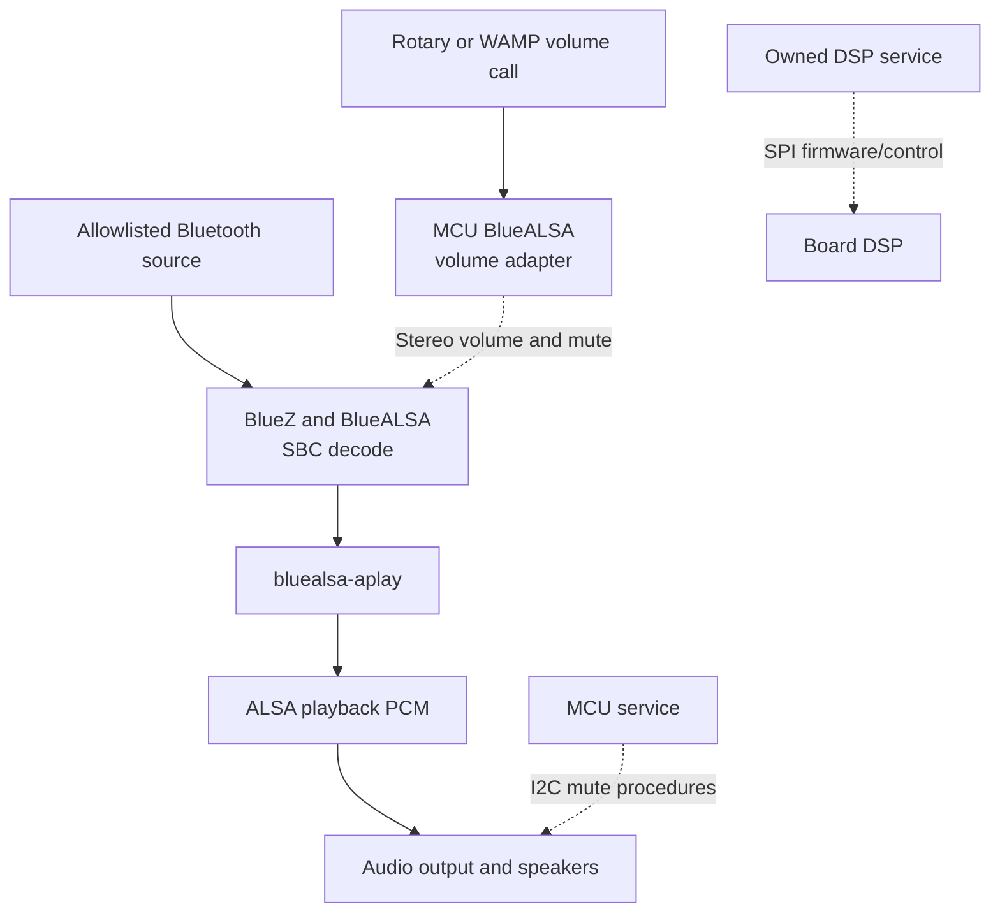

BlueZ and patched BlueALSA replace donor `music-source-manager` and `audio-ui`.
The bridge runs inside the static ARM `reinvoke-mcu-interface`, not a second
target-side music service. The [current contract](../current-product-contract.md)
is normative; recovered donor calls are consolidated in
[control-plane emulation](control-plane-emulation.md#audio-and-source-contracts).

## State authority

| State              | Authority                                  | WAMP projection                                      |
| ------------------ | ------------------------------------------ | ---------------------------------------------------- |
| Connected source   | BlueZ `org.bluez.Device1`                  | Source `com.harman.bluetooth`                        |
| Transport/playback | BlueZ transport and BlueALSA PCM lifecycle | Bluetooth stream state and `com.harman.stateChanged` |
| Music volume/mute  | BlueALSA `org.bluealsa.PCM1.Volume`        | Volume/mute procedures and events                    |

The MCU reads D-Bus state, handles physical rotary input before compatibility
publication, and writes both BlueALSA channels together. BlueALSA packs mute
bits and 0-127 A2DP volumes into one `uint16`; WAMP uses 0-100 with integer
nearest rounding:

```text
write: (percent * 127 + 50) / 100
read:  (rawVolume * 100 + 63) / 127
```

Mute is independent of volume zero. A newly acquired transport is capped at
12 percent; its PCM is polled every 250 ms. This is a connection policy, not
a loudness calibration. Reconnect and missing-PCM handling are fail-closed.
See [BlueALSA controller](../../tools/mcu-interface/bluealsa.go).

## PCM and speaker safety

This diagram describes software ownership and logical signal flow, not board
wiring. PCM samples follow ALSA, not the DSP service's SPI control channel.



There is no automatic speaker muting. The amplifier and DAC are opened once
the DAC is configured and stay open; they change only through the
`muteampcontrol` and `mutedaccontrol` procedures, and mute again on shutdown.

An earlier design polled ALSA every 100 ms and authorized physical unmute only
while a lease thread matched `owner_pid` and `/proc/<tid>/exe` resolved to one
packaged player, re-muting 1.5 seconds after that lapsed. That was this
project's invention rather than donor behaviour, and it silenced every sound
the runtime did not itself render, including the vendor's own startup chime.
It has been removed.

Initialization still mutes both while the IO expander is brought up, which is
what the donor does; its log line there reads `MCU init io expander. mute amp
and dac!!!`. See
[controller sequencing](../../tools/mcu-interface/controller.go).

## Host reference versus target

The dependency-free Node
[state core](../../tools/control/speaker-control-state.mjs),
[service](../../tools/control/speaker-control-service.mjs) and
[backend](../../tools/control/speaker-control-backend.mjs) test the compatibility
contract. One WAMP session registers eleven relevant procedures and subscribes
to rotary input. The core covers clamping, result shapes, event order and
source/stream state.

`--bluetooth-active` supplies a single-source test state without an adapter.
Reference rotary handling applies one logical percent per event, not a claimed
donor acceleration curve. The injectable backend requires an explicit
BlueALSA PCM path and source/transport observers; it serializes changes,
synchronizes stereo gain/mute and projects authoritative snapshots.

The target instead uses the packaged BlueALSA CLI with explicit peer/PCM
mapping and coalesced rotary updates. It runs neither Node.js nor the reference
modules.

## Evidence boundary

Host tests and historical RAM runs exercise the safety implementation.
Candidate 02 separately demonstrated native attended sound and rotary volume.
Candidate 03 has connection/provisioning evidence, not a repeated acoustic
campaign. Native microphone capture/mic-mute acceptance remains open.
Candidate-specific results belong in the
[native NAND guide](../native-nand-platform.md).
