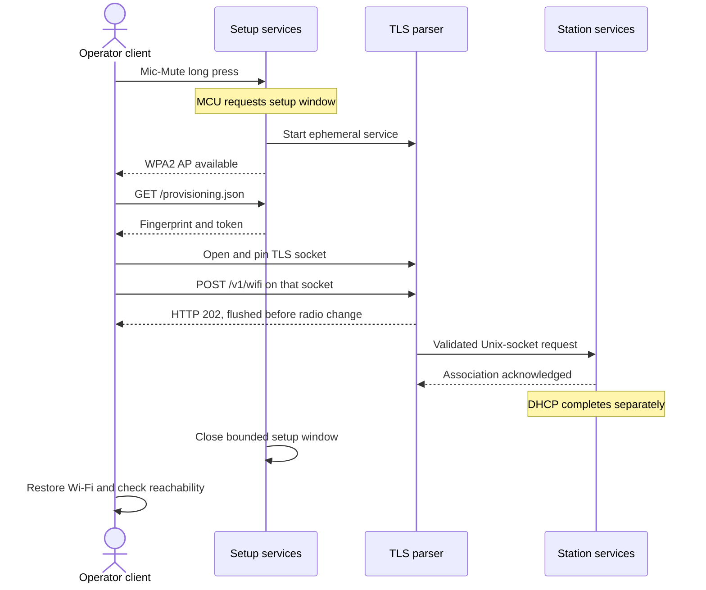

Provisioning is a physically requested, bounded AP-to-station handoff.
Candidates 02 and 03 completed attended onboarding; candidate 03 joined the
local network and answered ping. Its later SSH negotiation did not produce
a login. The [native ledger](native-nand-platform.md#current-result) records
those results; detailed isolation/failure/restart checks below remain RAM-scoped.
Credentials disappear after power loss.

## Current replacement components

The diagram combines implemented responsibilities with the externally observed
native handoff. The MCU requests setup; `reinvoke-provision-windowd`
supervises hostapd and BusyBox DHCP/HTTP on `p2p0`. The setup AP supplies no
gateway, DNS service or forwarding. Defaults are HTTP 8080 for the descriptor
and HTTPS 8443 for the parser.

`reinvoke-provisiond` parses requests; `reinvoke-wifi-applyd` owns credential
application and association; `reinvoke-networkd` owns DHCP, routes and resolver
state. Parser and adapter both run as UID 0. Separation limits code
responsibilities, not privileges.

Use the [tool guide](../tools/provisioning/README.md) for invocation.
Sources: [window owner](../tools/provisioning/windowd/main.go),
[parser](../tools/provisioning/main.go),
[adapter](../tools/provisioning/applyd/main.go),
[networkd](../tools/provisioning/networkd/main.go) and
[client](../tools/provisioning/configure-wifi.mjs).

## Authenticated parser

Implementation and offline/RAM-tested contract:

| Property       | Contract                                                                              |
| -------------- | ------------------------------------------------------------------------------------- |
| Bind           | Explicit AP address, `<ap-address>:8443`                                              |
| TLS            | In-memory ECDSA P-256 certificate; TLS 1.3 minimum                                    |
| Authentication | Random 256-bit token in `Authorization: Bearer <token>`                               |
| Lifetime       | Monotonic five-minute default, 15-minute maximum                                      |
| Input          | 4 KiB JSON limit; unknown fields rejected                                             |
| Handoff        | Bounded root-owned Unix socket, `SO_PEERCRED` validation and explicit acknowledgement |
| Completion     | One successful request per process; no parser credential logging or credential file   |

Authenticated endpoints are `GET /v1/status` and `POST /v1/wifi`.
POST requires `Content-Type: application/json` and exactly one JSON object.
Status returns `ready`, `expires_after_seconds` and optional `expires_utc`.
The Wi-Fi request fields are:

| Field        | Value                                     |
| ------------ | ----------------------------------------- |
| `ssid`       | 1-32 bytes, valid UTF-8; no NUL, CR or LF |
| `passphrase` | 8-63 bytes; no NUL, CR or LF              |
| `security`   | `wpa2-psk`                                |
| `hidden`     | Optional boolean                          |

The mode-0600 descriptor contains `url`, `token`, `certificate_sha256`,
`expires_after_seconds` and optional `expires_utc`.
It is removed on success, expiry or termination. The TLS private key remains
in process memory. With unset wall time, certificate validity spans 2000-2100
and lifetime stays monotonic; a sane clock adds `expires_utc`.

The adapter independently validates framing, fields, UID-0 peer and root-only
ramfs/tmpfs runtime directory. It derives a 256-bit WPA2 PSK using
PBKDF2-HMAC-SHA1 with 4,096 iterations and writes hexadecimal SSID/derived PSK
to mode-0600 RAM configuration, never the passphrase.
It invokes fixed root-controlled `wpa_supplicant`/`wpa_cli` without a shell.

The parser flushes HTTP 202 with `{"accepted":true}` before asynchronous
application: station association can change the shared radio channel and
destroy the setup connection. The adapter's later acknowledgement requires
`wpa_state=COMPLETED`; DHCP completes separately.
An apply failure stops the supplicant, removes derived configuration and
leaves the parser available for retry. It cannot replace the already-sent 202
with an error. HTTP 202 means request acceptance, not association, DNS,
reachability or SSH login.

## Bootstrap transport

The development bootstrap read `/run/reinvoke/provisioning.json` through root
ADB in a yellow-mode RAM boot. Native candidates instead serve that descriptor
through temporary HTTP on the WPA2 setup AP. Root-only file permissions do
not authenticate the HTTP resource.

Trust depends on an attended physical window and controlled setup-AP access.
A fingerprint retrieved over that network is not independent out-of-band
device identity. The client verifies the peer certificate on the actual TLS
socket before sending token or credentials; mismatch aborts delivery.
Explicit pinning replaces CA verification of the ephemeral self-signed
certificate.

> [!CAUTION]
> Anyone able to retrieve the setup descriptor obtains the provisioning token
> and certificate pin. Keep the setup window controlled and never log
> descriptors, AP credentials or station profiles.

Restoring the client network does not persist device credentials.
Persistent onboarding needs a separate power-loss, update, recovery and
secret-storage design.

## Network lifecycle

Networkd uses fixed root-controlled executables. PID 1 bounds its logs and
restarts a failed supervisor after five seconds;
`reinvoke.networkd=off` disables it for manual recovery.
The service validates DHCP address/mask, route, DNS and lifetime values before
publishing atomic RAM state.

Shutdown removes address, route, resolver link, lease and DHCP child.
Disconnect/reconnect and supervisor restart remove/reacquire that state.
Credential replacement swaps supplicant/DHCP children while keeping the
network supervisor. The source names `mlan0` for the observed RAM station
interface; older vendor `wlan0` examples are not the current interface contract.

## Validation record

Historical RAM evidence, not native shell inspection:

| Test group             | Result                                                                                                         |
| ---------------------- | -------------------------------------------------------------------------------------------------------------- |
| Parser and handoff     | 401 without token and authenticated status 200; no test credentials in logs                                    |
| Lifetime and cleanup   | Monotonic expiry with a 1970 clock; descriptor/socket removal on termination                                   |
| Input and ownership    | Strict JSON, root peer/path checks, WPA2 derivation vector and writable-directory rejection                    |
| Isolated AP            | WPA2 setup with no gateway/DNS, IPv4/IPv6 forwarding off; bounded-window cleanup and WAMP isolation            |
| Real station lifecycle | Association, DHCP acquisition/renewal, route/DNS reachability, disconnect/reconnect and credential replacement |
| Process ownership      | Duplicate supervisor rejected; stale reused-PID records did not signal unrelated processes                     |

Earlier synchronous-parser trials returned 502 on adapter failure. The current
response-before-apply contract instead permits a retry after asynchronous
failure. The first manual AP trial used dnsmasq and fake station executables;
its 202 proved transport, not real association. Later real-station and
packaged-window trials closed those narrower gaps.
[P1-046](../metadata/P1-046.json) records RAM lifecycle build provenance.

Native provisioning adds physical-trigger and external network evidence,
not native validation of every failure, cleanup or firewall branch.
