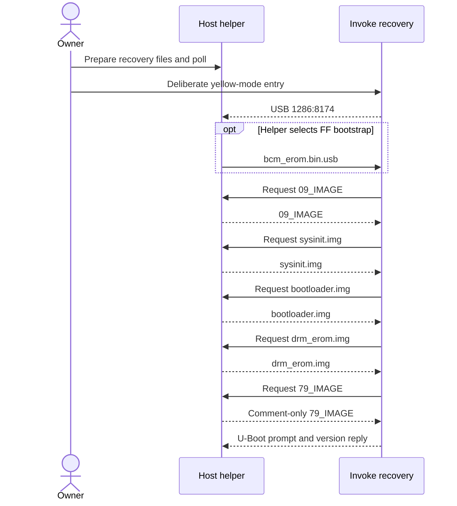

## Recovery boundary

Yellow service mode provides a host-loaded U-Boot console on the closed Invoke.
It is a recovery/development path, not native NAND startup. It subsequently
returned a working RAM Linux shell after the recorded failed NAND experiments.
The [native platform](native-nand-platform.md) owns normal-operation status.

> [!CAUTION]
> Recovery interrupts the running system. Use the powered procedure only in
> a deliberately controlled recovery window. Success after observed failures
> does not establish recovery from arbitrary boot-chain or whole-chip damage.

## Verified recovery sequence

The sequence follows observed file requests, not an inferred division between
ROM and later loaders. `09_IMAGE` and `sysinit.img` are distinct files.



The polling helper serves the bootstrap where applicable, then the requested
`09_IMAGE`, `sysinit.img`, `bootloader.img`, `drm_erom.img` and comment-only
`79_IMAGE`. The endpoint is a responsive U-Boot console. Neither this sequence
nor the limited recovery directory proves NAND-independent execution.

1. Use a known Micro-USB data cable. Charge-only cables produced false negatives.
2. Prepare recovery-only staging: `08_IMAGE` absent, `83_IMAGE` and `99_IMAGE`
   excluded, `79_IMAGE` comment-only. Active `79_IMAGE` commands execute
   automatically; the launcher checks this boundary.
3. Start capture and the original helper with its required console client:

   ```bash
   INVOKE_USBMON_INTERFACE=<usbmonN> INVOKE_CAPTURE_LIMIT_SECONDS=3600 \
     tools/usb-boot/capture-attempt.sh uboot-session original-absent
   ```

4. Wait for `READY: original usb_boot is polling for the device.`
5. Power off, hold the Reset pinhole, and restore power while holding Reset.
6. Still holding Reset, press MicOff four times within five seconds and confirm
   amber/yellow. Keep Reset held until the U-Boot console appears.
7. Confirm a fresh `version` response, not only an old prompt in a host log.

The measured console identifies itself as:

```text
U-Boot 2013.04 (Apr 11 2016 - 10:10:25)
MV88DE3100|>
```

The original helper must be polling before attachment. The pinned alternative
can also attach to an existing FF endpoint under the conditions below.
[USB tools](../tools/usb-boot/README.md) describes host preparation and staging;
there is no complete public recovery-firmware download in this repository.

## Helper and USB failure controls

Early ordinary-power and some yellow-mode trials requested only `08_IMAGE`,
then disconnected. Successful recovery requested the full `09_IMAGE` chain.
Successful traces included both FE and FF: the early claim that FE inherently
blocked recovery was incorrect. Panel color and subclass do not identify a
particular executing stage or diagnose signature failure.

The original helper selects its bootstrap branch from device subclass;
the [pinned alternative](https://github.com/jryruegas92/hk-invoke-arm-flasher/blob/63444e82cc5274abe31ec49ad55ee552b50b64b3/src/usb_boot_arm.c)
uses interface subclass. Capture both when diagnosing a transition.
The observed endpoint has image bulk OUT/IN `0x01`/`0x81` and console
interrupt OUT/IN `0x02`/`0x82`.

* The original helper waits for a TCP console client before watching USB.
  Host port 8141 is that relay, not a device administration service.
* A replacement client must consume telnet `IAC` negotiation without replying
  into the helper's `DONT`/`WONT` response loop.
* Redirected helper output is block-buffered; `stdbuf -oL -eL` exposes progress.
* A completed image or console-byte transfer establishes host delivery, not
  device execution. libusb status 1 is `LIBUSB_TRANSFER_ERROR`, not a device
  rejection code; disconnection can also occur between legitimate stages.
* Reset/power without four MicOff presses did not produce yellow on this unit,
  despite differing community instructions. Releasing Reset early caused resets.

`06_IMAGE` records the host USB path; `07_IMAGE` carries a little-endian image
size. Numbered files are not interchangeable firmware payloads.
`08_IMAGE` and `09_IMAGE` are opaque records, not proof of their executing
stage. Do not substitute guessed images to advance a stalled request.

## Reconnecting to a live session

Restarting the original helper generally did not resume its session.
It waited for hotplug, and USB reset did not change the device address.
Mid-session attachment could stop with `img transfer status 1?`.
Repeating deliberate yellow entry was the demonstrated original-tool recovery.

Helper revision `63444e82cc5274abe31ec49ad55ee552b50b64b3` later attached to
an existing FF endpoint without reset/replug, supplied the bootstrap, observed
FE, served the full chain and reached U-Boot. This also worked after the
12.2134.0 early-ADB trial. It does not qualify arbitrary reattachment states.

An ADB timeout on selected host port 5038 was a false negative when the existing
port-5037 server already owned a working RAM transport. Confirm actual USB
identity and a fresh shell before assigning failure to the kernel.
Host ADB port 5037 and helper port 8141 are not native device services.
Native network ADB, when present, is a separate TCP5555 service.

Routine passive observation may leave USB connected with helpers stopped.
Cable-only influence on boot remains unknown. A deliberate cable-disconnected
start tests host independence, not a universal prerequisite for ordinary boot.

## Board and storage facts read from the prompt

These are recovery-console observations, not installed Linux introspection.

| Property        | Observed value                                               |
| --------------- | ------------------------------------------------------------ |
| SoC family      | Marvell MV88DE3100 / BG2CD, revision a0                      |
| DRAM            | 512 MiB at `[0x00000000,0x20000000)`                         |
| SPI NOR         | M25P128, 16 MiB, 256 KiB sectors, mapped at `0xF0000000`     |
| NAND            | ID `98DA90157616`, 256 MiB, 128 KiB blocks, 2 KiB pages      |
| OOB             | 32 exposed bytes, distinct from Linux declaration/part size  |
| NAND randomizer | Reported not enabled in this console                         |
| eMMC / SD       | No card responded on `MV_SDIO`                               |
| Ethernet        | None detected                                                |

SPI NOR returned zeroes at sampled offsets; the full chip was not imaged.
U-Boot reported an invalid stored SPI environment and exposed compiled-in
defaults. Those vendor TFTP/NFS defaults are not an established installed-NAND
launch command. `nandrd` displays bytes; generic `boot` was not qualified.

CRC-valid NAND allocation tables superseded early sampled-content guesses.
The [NAND evidence](nand-write-decision.md#unit-facts-to-preserve) owns the map,
five uncorrectable pages, physical bad blocks, BBT reservations and OOB limits.
An out-of-range vendor example address was not a rootfs identification.

## Known RAM recovery pair

The demonstrated corrected pair uses release/module ABI
`3.8.13-reinvoke-audio-sd8887`. Its build version is
`#1-mtd-cleanup SMP PREEMPT Thu Jan 1 00:00:00 UTC 1970`.
The correction removes the temporary-MTD mapping lifetime defect without
changing RC12 runtime or module ABI.

```text
81_IMAGE SHA-256:
708c8a17a2817b1d44216b1597e2e3cf6d59d366d95d804bdb96b16d2ecaf32e
82_IMAGE RC12 SHA-256:
a0f273ddfb4a7a3844078b88f4ff826a1f1d1c7ae8c01b77b87533e3bf8985de
```

Use held artifacts matching both pins. The loader's wrong-hash control rejected
preparation before staging; source compatibility alone is not a substitute.
The [RAM input contract](native-ram-platform.md#working-input-contract) explains
the held inputs and [USB tools](../tools/usb-boot/README.md) owns loader flags.

The established U-Boot handoff loads kernel and initramfs into DRAM:

```text
usbload 0x81 0x0c400000
usbload 0x82 0x08000000
set bootargs console=ttyS0,115200 loglevel=8 debug root=/dev/ram rdinit=/init init=/init initrd=0x08000000,<generated-size>
bootm 0x0c400000
```

`<generated-size>` must be the actual initramfs length. After handoff, verify
a fresh shell, `/bin/busybox uname`, `/proc/version`, command line and mounts.
The demonstrated RAM runtime kept NAND unmounted. A read-only MTD capture
returned the full data area but not physical OOB; the five uncertain pages
prevent interpreting it as a complete raw restore.

## Command and evidence limits

Bounded `version`, `help`, `printenv` and `bdinfo` queries were demonstrated.
Read intent is not a stability guarantee: `imls` and a large `md.b` request
aborted this customized U-Boot. The
[withdrawn methods](nand-write-decision.md#withdrawn-methods) record why those
probes and guaranteed-restore assumptions were abandoned.

Recovery-only work excludes NAND erase/program, persistent environment changes
and active flash bundles. Later native `83_IMAGE` installations used a separate
vendor operation that erased/reprogrammed the whole good-block set.
Initial recovery issued no intentional write, but did not establish absence of
autonomous early-stage writes or recovery independent of stored boot data.

A returned RAM shell cannot retrieve the preceding failed native session's
volatile checkpoints. Download mode is not U-Boot, U-Boot is not Linux, and
enumeration is not a shell. Missing USB likewise does not prove failed native
boot: candidates 02 and 03 performed useful native work without it.
